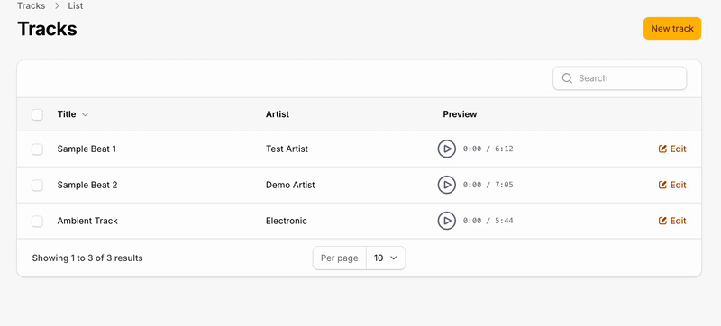

# Filament Audio Field & Column

A Filament V4 plugin that provides audio player components with circular progress for forms, tables, and infolists.




## Features

- Play/Pause button with smooth animations
- Circular progress indicator (SVG-based)
- Support for local and remote audio files (MP3, etc.)
- Dark mode support
- Optional volume control
- Optional duration display
- Customizable size and progress color
- Auto-pause when another player starts (only one plays at a time)
- Works in Tables, Infolists, and Forms

## Installation

```bash
composer require ultraviolettes/filament-audio-field-column
```

## Usage

### Table Column

Display an audio player in your table:

```php
use Ultraviolettes\FilamentAudio\Tables\Columns\AudioColumn;

public static function table(Table $table): Table
{
    return $table
        ->columns([
            AudioColumn::make('audio_url')
                ->label('Preview'),

            // Or with a custom URL
            AudioColumn::make('preview')
                ->audioUrl(fn ($record) => $record->getAudioUrl())
                ->size(40)
                ->progressColor('#10b981'),
        ]);
}
```

### Infolist Entry

Display an audio player in your infolist:

```php
use Ultraviolettes\FilamentAudio\Infolists\Components\AudioEntry;

public static function infolist(Infolist $infolist): Infolist
{
    return $infolist
        ->schema([
            AudioEntry::make('audio_url')
                ->label('Audio Preview')
                ->showDuration()
                ->showVolume(),
        ]);
}
```

### Form Field

Display an audio preview in your form (read-only player):

```php
use Ultraviolettes\FilamentAudio\Forms\Components\AudioField;

public static function form(Form $form): Form
{
    return $form
        ->schema([
            AudioField::make('audio_url')
                ->label('Audio Preview')
                ->audioUrl(fn ($record) => $record?->audio_url)
                ->showDuration()
                ->showVolume()
                ->size(48),
        ]);
}
```

## Configuration Options

All components support the following options:

| Method | Description | Default |
|--------|-------------|---------|
| `audioUrl(string\|Closure)` | Set the audio URL directly | Uses state value |
| `size(int)` | Size of the player in pixels | 32 (column/entry), 48 (field) |
| `progressColor(string)` | Color of the progress circle | `#00bfff` |
| `showDuration(bool)` | Show the duration display | false (column/entry), true (field) |
| `showVolume(bool)` | Show volume control | false |

## Examples

### Basic Table Column

```php
AudioColumn::make('audio_file')
```

### Customized Column

```php
AudioColumn::make('preview')
    ->label('Audio')
    ->audioUrl(fn ($record) => Storage::url($record->audio_path))
    ->size(36)
    ->progressColor('#f59e0b')
    ->showDuration()
```

### Full-Featured Form Field

```php
AudioField::make('audio_preview')
    ->label('Current Audio')
    ->audioUrl(fn ($record) => $record?->getFirstMediaUrl('audio'))
    ->size(56)
    ->progressColor('#8b5cf6')
    ->showDuration()
    ->showVolume()
```

### With Spatie Media Library

```php
AudioColumn::make('audio')
    ->audioUrl(fn ($record) => $record->getFirstMediaUrl('tracks'))
```

### Remote URLs

```php
AudioColumn::make('sample')
    ->audioUrl('https://example.com/audio/sample.mp3')
```

## Styling

The component uses Tailwind CSS classes and supports dark mode out of the box. The progress circle color can be customized using the `progressColor()` method with any valid CSS color value:

```php
->progressColor('#10b981')     // Hex
->progressColor('rgb(16, 185, 129)')  // RGB
->progressColor('deepskyblue') // Named color
```

## Browser Support

The audio player uses the native HTML5 `<audio>` element and supports all modern browsers. Supported audio formats depend on the browser:

- **MP3**: All modern browsers
- **WAV**: All modern browsers
- **OGG**: Firefox, Chrome, Opera
- **AAC**: Safari, Chrome, Edge

## Requirements

- PHP 8.2+
- Laravel 11+
- Filament 4.x

## Contributing

Contributions are welcome! Please feel free to submit a Pull Request.

## License

MIT License. See [LICENSE.md](LICENSE.md) for more information.

## Credits

- Inspired by the audio preview component from [BTY Monorepo](https://github.com/ultraviolettes)
- Built with [Filament](https://filamentphp.com)
- Uses [Alpine.js](https://alpinejs.dev) for interactivity
